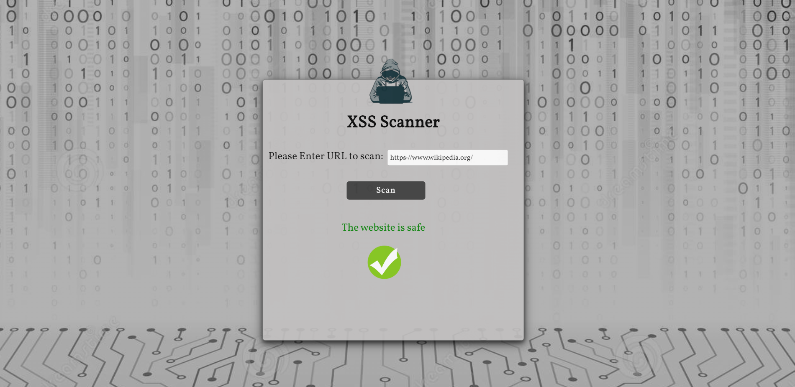

# XSS Scanner

Le Cross-Site Scripting (XSS) est l'une des vulnérabilités les plus connues des applications Web. Il a même un chapitre dédié dans le projet OWASP Top 10 et c'est une vulnérabilité très recherchée dans les programmes de bug bounty.

Le scanner obtient un lien de l'utilisateur et recherche la vulnérabilité XSS sur le site Web en injectant des scripts malveillants à l'endroit d'entrée. L'injection se produit dans un navigateur sans tête nommé Chromium et contrôlé par l'automatisation de Puppeteer.

Il fonctionne en deux étapes :
1. Trouver la cible : Dans cette première étape, l'outil essaie d'identifier tous les endroits de la page, y compris les paramètres injectables dans les formulaires, les URL, les en-têtes, etc.
2. Test pour XSS : Pour chaque endroit découvert à l'étape précédente, le scanner essaiera de détecter si les paramètres sont vulnérables au Cross-Site Scripting. L'outil injecte un morceau de code JavaScript, y compris des caractères HTML spéciaux (>, <, ", ') et il essaiera de voir s'ils sont renvoyés dans la page de réponse sans nettoyage.
Si l'outil détecte au moins une vulnérabilité, il renverra que le site Web a une vulnérabilité XSS.

### Technologies
 * Puppeteer
 * Javascript
 * NodeJS
 * Express
 
 
 
### Comment installer

Clone the repository:
```
git clone https://github.com/MariaGarber/XSS-Scanner.git
```
Enter the clonned folder:
```
cd XSS-Scanner
```
Install the dependencies:
```
npm install
```
Run the application:
```
npm start
```
Open the browser at http://localhost:4000/

###  Ce fut vraiment un plaisir 
###  EpsilonCoder 


###  DIADIEUF
